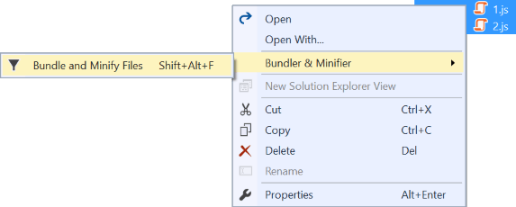
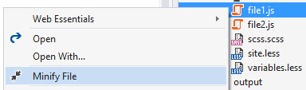
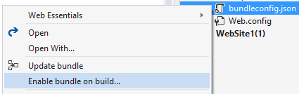
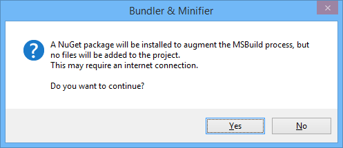
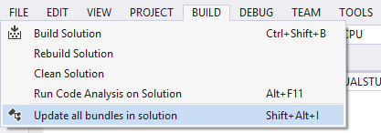
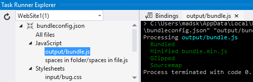
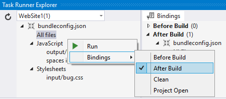

# Bundler and Minifier

A Visual Studio extension that let's you configure bundling and
minification of JS, CSS and HTML files.

[](https://ci.appveyor.com/project/madskristensen/bundlerminifier)
[](https://www.nuget.org/packages/BundlerMinifier.Core/) 

Download the extension at the
[VS Gallery](https://visualstudiogallery.msdn.microsoft.com/9ec27da7-e24b-4d56-8064-fd7e88ac1c40)
or get the
[nightly build](http://vsixgallery.com/extension/a0ae318b-4f07-4f71-93cb-f21d3f03c6d3/)

---------------------------------------

See the
[changelog](https://github.com/madskristensen/BundlerMinifier/blob/master/CHANGELOG.md)
for changes and roadmap and the 
[wiki](https://github.com/madskristensen/BundlerMinifier/wiki)
for more details.

## Features

- Bundles CSS, JavaScript or HTML files into a single output file
- Saving a source file triggers re-bundling automatically
- Support for globbing patterns
- MSBuild support for CI scenarios supported
- Minify individual or bundled CSS, JavaScript and HTML files
- Minification options for each language is customizable
- Shows a watermark when opening a generated file
- Task Runner Explorer integration
- Command line support
- Shortcut to update all bundles in solution

### A note about encoding
All files without a BOM (Byte Order Mark) is treated as UTF-8. If you
see strange characters in the output bundle files, you may want to consider
saving the input files as UTF-8 or an encoding that lets you specify a BOM.

### Bundling

Select 2 or more of the same type of files in Solution Explorer
to create a bundle.



Any edits being made to the source files will instantly produce
updated bundle file output.

The bundle configuration is stored in a file called `bundleconfig.json`
which gets added to the root of the project.

### Minification

Minify any JS, CSS or HTML file by right-clicking it in Solution
Explorer. That will create a `<filename>.min.<ext>` and nest
it under the original file.



When the original file is modified, a new min file is produced
instantly.

### Bundle on build / CI support

In ASP.NET MVC and WebForms projects you can enable bundling and
minification as part of the build step. Simply right-click the
`bundleconfig.json` file to enable it.



Clicking the menu item will prompt you with information about what will
happen if you click the OK button.



A NuGet package will be installed into the `packages` folder without adding
any files to the project itself. That NuGet package contains an MSBuild
task that will run the exact same compilers on the `bundleconfig.json`
file in the root of the project.

### Update all bundles

You can run the bundler on all `bundleconfig.json` files
in the solution by using the keyboard shortcut `Shift+Alt+i`
or by using the button on the top level Build menu.



### Source maps

Source maps are supported for JavaScript minification only at this time.

A `.map` file is produced next to the `.min.js` file automatically,
but if you manually delete the `.map` file, a new one will not be
created on subsequent minifications.

To enable source maps, add this property to the `bundleconfig.json`
file:

```json
"sourceMap": true
```

### Task Runner Explorer
Get a quick overview of the files you've specified or execute a bundle
directly in Task Runner Explorer.



You can even set bindings so that bundling/minification happens automatically
during certain Visual Studio events, such as BeforeBuild and Project Open.



### bundleconfig.json

The extension adds a `bundleconfig.json` file at the root of the
project which is used to configure all bundling.

Here's an example of what that file looks like:

```js
[
  {
    "outputFileName": "output/bundle.css",
    "inputFiles": [
      "css/lib/**/*.css", // globbing patterns are supported
      "css/input/site.css"
    ],
    "minify": {
        "enabled": true,
        "commentMode": "all"
    }
  },
  {
    "outputFileName": "output/all.js",
    "inputFiles": [
      "js/*.js",
      "!js/ignore.js" // start with a ! to exclude files
    ]
  },
  {
    "outputFileName": "output/app.js",
    "inputFiles": [
      "input/main.js",
      "input/core/*.js" // all .js files in input/core/
    ]
  }
]
```

## Contribute
Check out the [contribution guidelines](.github/CONTRIBUTING.md)
if you want to contribute to this project.

For cloning and building this project yourself, make sure
to install the
[Extensibility Tools 2015](https://visualstudiogallery.msdn.microsoft.com/ab39a092-1343-46e2-b0f1-6a3f91155aa6)
extension for Visual Studio which enables some features
used by this project.

## License
[Apache 2.0](LICENSE)